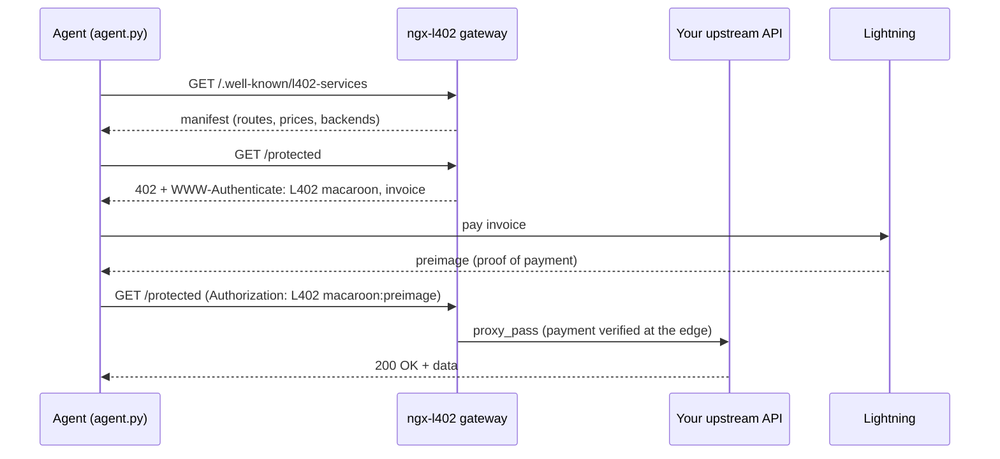

# Agent pays per call

An autonomous agent that buys an API response over **L402** — no API key, no
account, no human in the loop. This is the canonical "agent economy" demo: a
script (or LLM tool, or MCP server) discovers a paid endpoint, pays a Lightning
invoice for a single call, and gets the data back.



The whole point: the gateway does the paywall, your upstream API never learns
about Lightning, and the agent's logic is ~4 HTTP calls. Lift `agent.py`'s flow
straight into an LLM tool and an agent can pay for data on demand.

## What's here

| File | Purpose |
|---|---|
| `agent.py` | The autonomous L402 client — discover → 402 → pay → retry → 200 |
| `requirements.txt` | One dependency: `requests` |
| `.env.example` | Sample gateway / LND settings |

## Run it

```bash
pip install -r requirements.txt
```

You need a running **ngx-l402 gateway** to buy from. Pick the path that fits.

### Path A — fastest taste (any wallet, `--payer manual`)

Point the agent at any gateway and pay the invoice yourself with a phone wallet.
The agent prints the invoice, you pay, paste the preimage back, and it completes
the call. Works against any deployment, zero infra.

```bash
python agent.py --gateway https://your-gateway.example.com --path /protected
```

> With an LNURL/mainnet backend the invoice is real — keep the price tiny
> (a few sats) while testing.

### Path B — local & free (regtest, fully autonomous)

Use the module's regtest dev stack as the **server**, and an LND node you
control as the agent's wallet (`--payer lnd-rest`).

1. Start the gateway from the [`ngx_l402`](https://github.com/ngx-l402/ngx-l402)
   repo (`docker compose up -d bitcoind lndnode-receiver redis nginx-lnd`, then
   fund it — see that repo's macOS setup guide). The gateway listens on `:8000`
   with a paid `/protected` route.
2. Give the agent a funded LND that has a channel to the gateway's node, and
   point `--payer lnd-rest` at its REST port:

```bash
python agent.py \
  --gateway http://localhost:8000 --path /protected \
  --discover \
  --payer lnd-rest \
  --lnd-rest-url https://127.0.0.1:8080 \
  --lnd-macaroon-hex "$(xxd -ps -c2000 /path/to/admin.macaroon)" \
  --lnd-no-verify
```

### Path C — autonomous on your own node

Same as Path B, but `--gateway` is your real deployment and `--lnd-rest-url`
is your own mainnet LND. This is the shape of a production agent.

## Auto-detect mode

If the gateway has `l402_auto_detect_payment on`, add `--auto-detect`: the agent
pays and then retries with **just the macaroon** — the gateway confirms
settlement by querying its own node, so the agent never has to handle a preimage.

## Expected transcript

```
ngx-l402 · autonomous agent demo
gateway: http://localhost:8000   route: /protected   payer: lnd-rest

[1] Discover the API (capability manifest)
    GET http://localhost:8000/.well-known/l402-services
    ✓ discovered 'Example API' — pays via LND
      · /protected  —  10000 msat

[2] Request the protected route (no payment yet)
    GET http://localhost:8000/protected
    ✓ 402 Payment Required
    macaroon: AgEEbDQwMgJCAAA1...
    invoice:  lnbc100n1p5...

[3] Pay the Lightning invoice
    ✓ paid — preimage 7a3c91b4e2d058f1c6b9…

[4] Retry with proof of payment
    Authorization: L402 AgEEbDQwMgJCAAA1...:7a3c91b4e2d0…
    ✓ 200 OK — paid response unlocked

    { "ok": true, "data": "..." }
```

## Turning this into an MCP tool

The same four steps wrapped as an MCP tool are the
[`mcp-paid-tool`](../mcp-paid-tool/) example — so Claude Desktop (or any MCP
client) can buy calls on demand, with the model never seeing a key or a balance.
