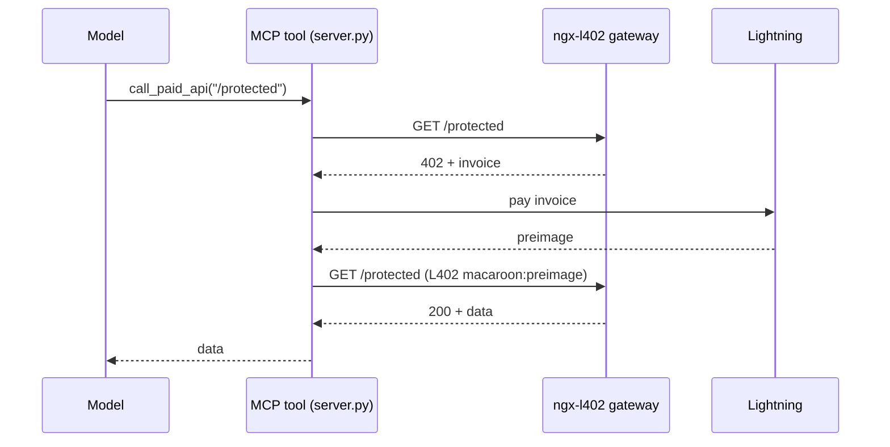

# MCP paid tool

Expose ngx-l402's pay-per-call flow as an **MCP server** so an agent — Claude
Desktop, or any [Model Context Protocol](https://modelcontextprotocol.io) client —
can buy API calls over Lightning on demand. The agent calls a tool; the tool
pays the invoice; the model never handles a key or a balance.

Two tools:

- `list_paid_routes()` — the gateway's `/.well-known/l402-services` manifest, so
  the agent can discover what's for sale and what it costs.
- `call_paid_api(path, method, body)` — buys one call and returns the response.
  Pays the L402 invoice automatically from a Lightning node you control.



## Setup

```bash
pip install -r requirements.txt
cp .env.example .env   # then fill in LND_REST_URL + LND_MACAROON_HEX
```

You need:
- a running **ngx-l402 gateway** (`L402_GATEWAY`), and
- an **LND node** the server can pay from (`LND_REST_URL`, `LND_MACAROON_HEX`).
  A funded regtest node from the
  [module repo's dev stack](https://github.com/ngx-l402/ngx-l402) works.

## Run standalone

```bash
L402_GATEWAY=http://localhost:8000 \
LND_REST_URL=https://127.0.0.1:8080 \
LND_MACAROON_HEX="$(xxd -ps -c2000 admin.macaroon)" \
LND_NO_VERIFY=1 \
python server.py
```

The server speaks MCP over stdio.

## Use from Claude Desktop

Add to `claude_desktop_config.json` (Settings → Developer → Edit Config):

```json
{
  "mcpServers": {
    "ngx-l402": {
      "command": "python",
      "args": ["/absolute/path/to/examples/mcp-paid-tool/server.py"],
      "env": {
        "L402_GATEWAY": "http://localhost:8000",
        "LND_REST_URL": "https://127.0.0.1:8080",
        "LND_MACAROON_HEX": "0201036c6e64...",
        "LND_NO_VERIFY": "1"
      }
    }
  }
}
```

Restart Claude Desktop, then ask it to *"list the paid routes, then buy
/protected."* It will call `list_paid_routes`, then `call_paid_api`, paying the
invoice behind the scenes.

> Pair this with the [`llm-api-paywall`](../llm-api-paywall/) demo and an agent
> can buy *LLM completions* per call:
> `call_paid_api("/v1/chat/completions", "POST", '{"model":"llama3.2","messages":[...]}')`.

## Security note

`LND_MACAROON_HEX` can spend from your node. Use a node with a small balance for
demos, scope the macaroon to send-only if you can, and never commit the value.
